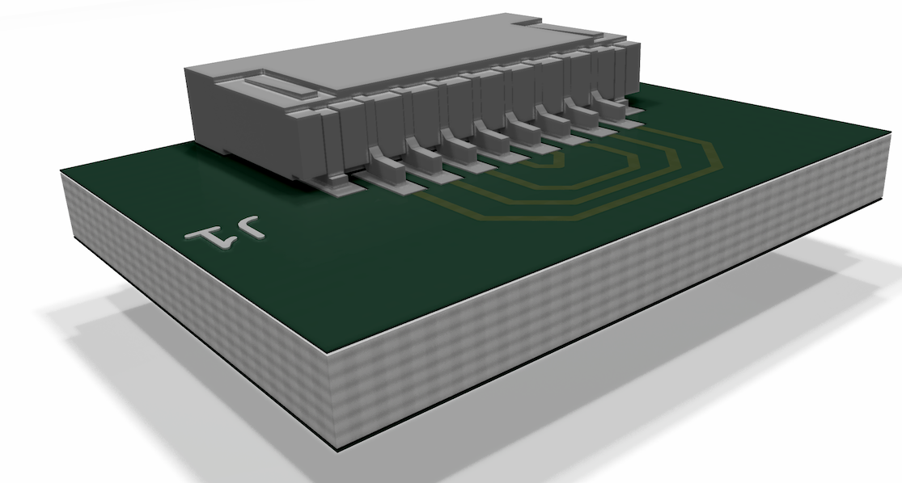

# Amphenol HFW8R-1STE1LF
## kicad footprint
* amphenol HFW8R-1STE1LF - compact fpc connector 8-wires, 1mm spacing
* see [octopart](https://octopart.com/hfw8r-1ste1lf-amphenol+icc-90335451?r=sp&s=5qMbWiLUREO7aaNVjMOubg#)
* The connector is used on the [teensy 4.0](https://www.pjrc.com/store/teensy40.html) to connect a micro-sd card. (The connector is mentioned [here](https://www.pjrc.com/breakout-board-for-teensy-4-0/) too)
* stp file sourced from here: https://www.amphenol-icc.com/fpc-ffc-hfw8r1ste1lf.html

