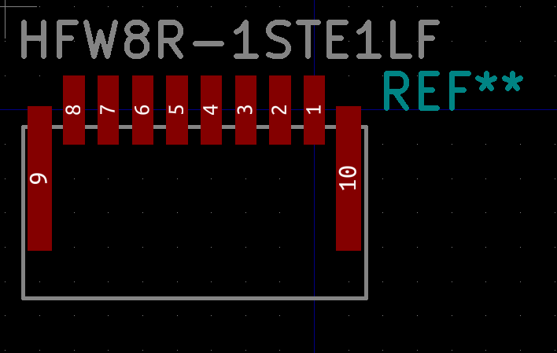

# Amphenol HFW8R-1STE1LF
* a kicad footprint for amphenol HFW8R-1STE1LF - compact fpc connector 8

This connector is used on the [teensy 4.0](https://www.pjrc.com/store/teensy40.html) to connect a micro-sd card. 

stp file sourced from here: https://www.amphenol-icc.com/fpc-ffc-hfw8r1ste1lf.html
